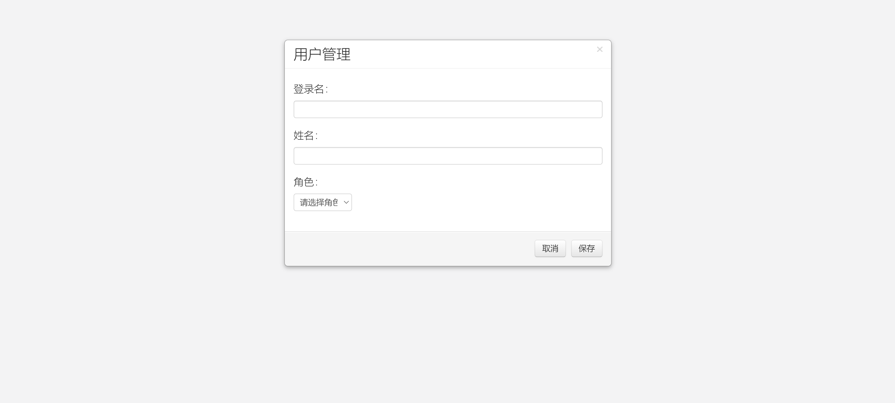
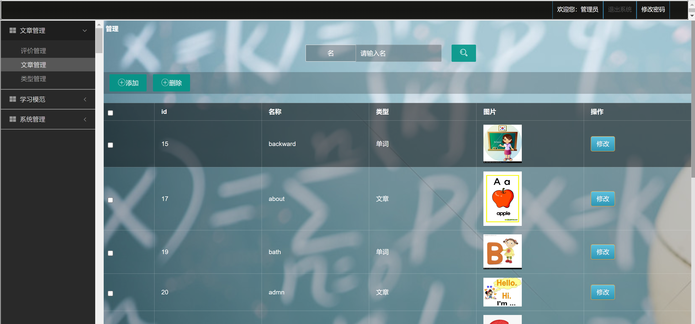
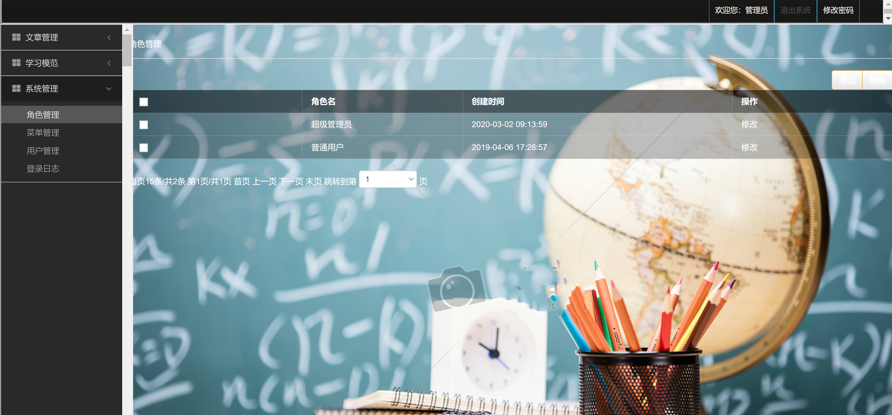
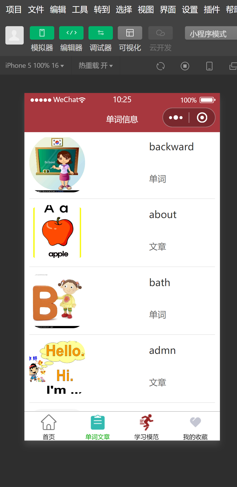
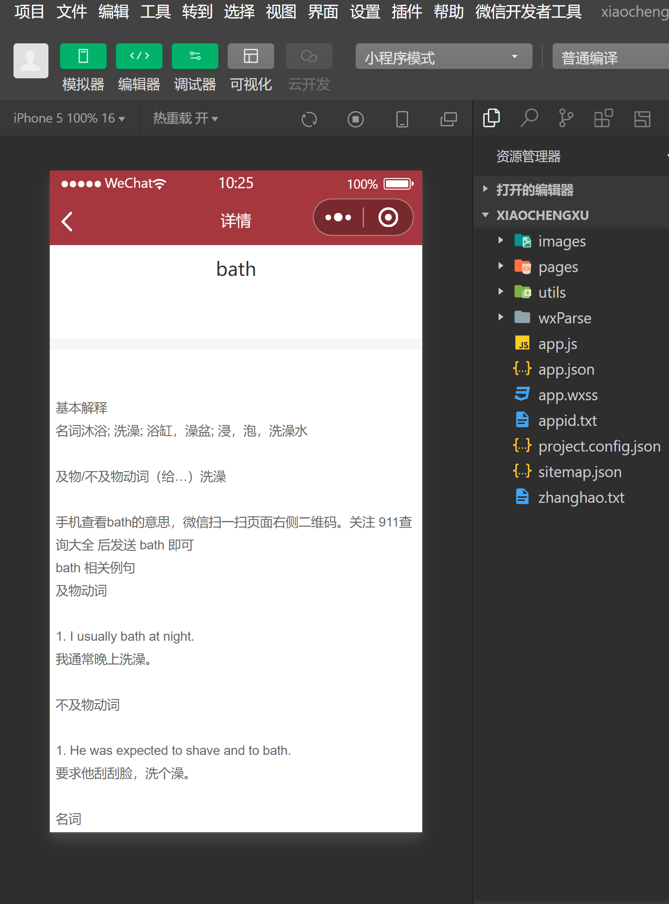
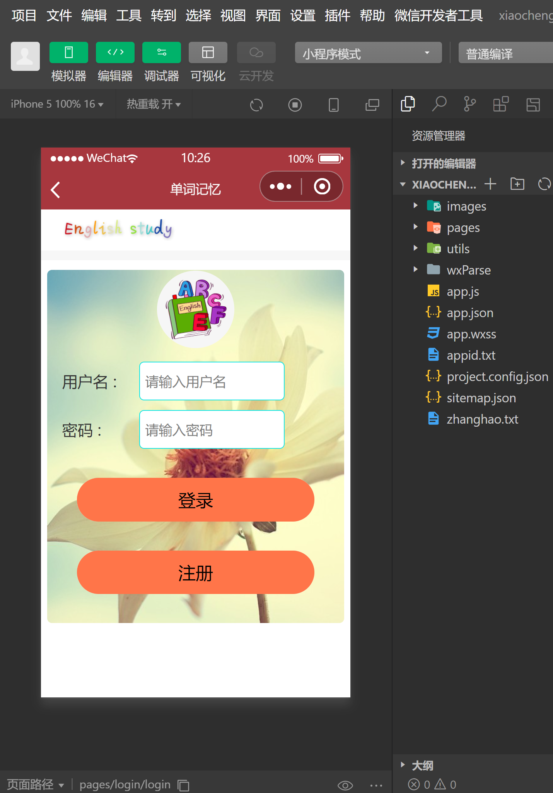

<h1 align="center">单词记忆管理系统</h1>

## 简介
单词记忆管理系统：包含管理员和用户角色；功能包括单词详细解释、用户信息管理、单词记忆状态跟踪、文章和类型管理，以及便捷的搜索和编辑功能。    --计算机毕业设计源码；毕设源码；java毕业设计源码

## 联系方式

<h3 align="center">获取完整代码与数据库文件 + 微信：deepguan QQ: 86050149 QQ群: 783742310</h3>

<h3 align="center">可帮忙远程部署 包运行成功！提供远程部署、修改代码、设计文档指导、代码讲解等服务！</h3>

## 功能介绍（完整见运行截图）
管理员：提供后台管理功能，如登录、用户信息录入与更新，包括登录名、姓名和角色的管理。可进行单词及文章管理，支持添加、删除、编辑及搜索。还可以查看和修改个人信息，管理系统设置及权限。

普通用户：访问前端功能，通过登录进入系统。主要功能包括查看和记忆单词，搜索单词及其用法示例。用户可以通过添加单词按钮扩展自己的学习资源，并使用分类和记忆状态来组织和跟踪学习进度。

开发者：负责系统设计和实现，包括用户界面与功能开发。关键功能模块包括用户管理、单词记忆与管理、微信接口集成等。使用配置文件和代码文件如app.js、project.config.json等来实现和维护系统功能。

## 运行截图

本代码来源于网络,仅供学习参考使用!

